Okay, here's a draft of a Notion page based on the provided transcript, designed to be educational for tech-savvy individuals.

---

# Startup Structuring: A Tech Founder's Guide

### Introduction
In the fast-paced world of tech startups, getting the technical details right is just as crucial as having a killer product. Structuring your company correctly from the outset—including choosing the right jurisdiction and legal framework— is not just about compliance; it’s about setting the stage for investment, growth, and ultimately, a successful exit. This guide will help tech professionals navigate the crucial aspects of startup structuring, using analogies that resonate with their technical backgrounds.

### Table of Contents
1. Why Structuring Matters
2. Typical Startup Structure: Holding vs Operating Companies
3. Key Benefits of Proper Structuring
4. Choosing the Right Jurisdiction
5. Tax Implications for Startups
6. Timing: When to Structure Your Startup
7. Budgeting for Structuring
8. Operating Company Considerations
9. What if I Delay Setting Up a Holding Company?
10. Other Costs to Consider
11. Timelines: How Long Does It Take?
12. Key Legal Documents
13. Navigating Banking Challenges
14. Common Structuring Myths
15. Structural Recap

---

## Why Structuring Matters
Structuring your startup is like choosing the right tech stack—it's fundamental and has long-term consequences. Selecting the correct structure impacts your ability to attract investment, manage tax liabilities, and protect your assets. Unlike a tech stack which can be refactored, changing your legal structure later is costly and complicated. It's a critical decision best made early and with careful planning.

**Why This Matters:** A well-structured company signals seriousness and professionalism, making investors more confident. Ignoring this step is akin to building a complex application on a shaky foundation—it’ll likely crumble under pressure.

## Typical Startup Structure: Holding vs Operating Companies
Imagine your startup as a multi-layered application. You have your core logic (the holding company) and the user interface (the operating company):

```mermaid
graph LR
    A[**Holding Company**<br>#ffffff;]:::dark --> B[**Operating Company**<br>#ffffff;]:::dark
    style A fill:#1a1a1a,stroke:#ffffff,stroke-width:1px
    style B fill:#1a1a1a,stroke:#ffffff,stroke-width:1px
    
    
    classDef dark fill:#1a1a1a,stroke:#ffffff,stroke-width:1px,color:#ffffff
    
    A -- **Assets (IP, Companies)** --> A
    A -- **Investment** --> B
    B -- **Customers** --> B
    B -- **Employees** --> B
    B -- **Revenue** --> B
    B -- **Costs** --> B
```


- **Holding Company:** This is a passive entity whose primary purpose is to hold assets, like intellectual property (IP), investments in other companies, and other intangible assets. Think of it as your startup's "data store" for valuable assets.
- **Operating Company:** This is where the day-to-day business happens. You transact with customers, hire employees, generate revenue, and incur costs. It's like the “application layer” that users interact with.

**Why This Matters:** Separating these entities provides a layer of protection. If one operating company in a specific jurisdiction needs to be wound up (think: a failed feature release), it won't affect the overall structure and ownership.

## Key Benefits of Proper Structuring
Structuring your startup in the right way brings several key advantages, all aimed at optimizing growth, investment, and risk management:

-   **Attracting Investment:** The right jurisdiction makes your company appealing to sophisticated investors. They understand the legal frameworks and feel confident about their rights.
-   **Investor & Founder Protection**: Favored jurisdictions provide legal systems that protect the interests of both Founders and investors, similar to robust security measures in a well-built application.
-   **Global Investment:** You avoid restrictions on foreign ownership, similar to enabling cross-platform compatibility, allowing investments from anywhere in the world.
-   **Cost Efficiency:** Holding companies are typically passive and therefore often have lower operational costs, similar to efficient serverless architectures.

**Why This Matters:** Choosing the right legal structure is not just about legal compliance; it’s a strategic move that opens up opportunities for investment and growth.

## Choosing the Right Jurisdiction
Think of choosing a jurisdiction as picking the right cloud provider for your application—it has implications for performance, security, and cost. Here are the primary jurisdictions for startups:
| Jurisdiction | Initial Setup Cost (USD) | Key Features                                                                                   |
| ------------ | ---------------------- | ---------------------------------------------------------------------------------------------- |
| ADGM         | 3,295                  | Strong legal system, suitable for GCC-focused startups                                            |
| Cayman Islands| 2,900                  | Tax-free, popular among VCs (many VCs are set up here themselves)                                                        |
| Delaware     | 495                    | US-centric, established, but not tax-free, may not be ideal for non-US businesses                                      |
| DIFC         | Similar to ADGM      | Common Law Free Zone, similar benefits to ADGM                                                     |

**Why This Matters**: While Delaware is tempting because it's cheap, cost is not the only factor. ADGM and Cayman are tax-free and more suitable for non-US based companies with global aspirations.

## Tax Implications for Startups
Tax can be a confusing topic, but it’s crucial for long-term financial health. Here are the tax types to consider:
- **Personal Income Tax:** This depends on where you live. Like choosing your programming language, this is a matter of personal preference.
- **Company Profit Tax:** For startups, this is not usually a major issue as they typically don't make a profit in the early stages.
- **Capital Gains Tax:** This is a tax on the profits when you sell your business (exit). It can have a huge impact at the end and can be avoided depending on where your holding company is set up.
-   **Delaware Capital Gains Tax:** 21% on exit.

**Why This Matters:** While Delaware is popular, its capital gains tax can be a major drawback. Tax-free jurisdictions like ADGM and Cayman can be significantly more beneficial for founders in the long run.

## Timing: When to Structure Your Startup
Timing your structure is as critical as your product release schedule. You should set up your holding company when:
-   Raising Money: When you start speaking with investors, even friends and family.
-   Hiring Your First Employee: When you give out share options.
-   Registering IP: Before commercializing your product or service.
-   Finalizing Founders Agreement: As soon as possible to protect the business and Founders from disputes.

**Why This Matters:** Setting up the holding company too late can lead to messy legal situations. Doing it early demonstrates preparedness to investors and helps clarify the ownership of your IP.

## Budgeting for Structuring
Just as you budget for your infrastructure costs, you must budget for startup structuring.
- **First-Year Budget:** Plan for $20,000 to $25,000 to cover all setup and legal costs.
- **Founders Investment:** Founders should ideally pay for the initial structuring out of their pockets, indicating confidence and commitment.

**Why This Matters:** Under-budgeting can lead to quick but ultimately poor decisions, akin to choosing a cheap server that can’t handle load.

## Operating Company Considerations
Think of your operating company's location as the “location” of your servers—it impacts accessibility, speed, and cost. Factors to consider:
-   **Access to Staff:** Is it easy for employees to reach the office?
-   **Office Space:** Are good offices available and affordable?
-   **Ecosystem:** Is there a thriving startup community with VCs?
-   **Expansion Costs:** What are the visa and expansion costs?

**Why This Matters:** These operational costs significantly impact team morale, operating expenses, and overall startup health.

## What if I Delay Setting Up a Holding Company?
Founders sometimes set up an operating company first to try and move faster and save money. However, this approach is risky as:
- **Safe notes may not work**: Using safe notes in an entity that is not a holding company creates the risk that they will not be enforceable.
- **Multiple Agreements:** You’ll need to re-sign or re-issue all documents with the proper holding company, a hassle especially when dealing with multiple investors, akin to doing a messy database migration.
- **Potential Transfer Fees:** You will need to pay fees to transfer all your assets to your holding company and novate (transfer over) any previous agreements.

**Why This Matters**: Delaying the holding company setup creates unnecessary complexity and risks costly cleanup.

## Other Costs to Consider
Just like unexpected cloud service fees, additional costs can pop up:
-   **Notarization and Legalization:** Essential for cross-border operations, can cost $3000-$5,500
-   **Certificate of Incumbency:** Needed for banking and operations, comes with its own fees.
-   **Visa Costs:** Not included in the setup costs, you'll need to budget for them.
-   **Minimum Bank Balances:** May be required to start an account.
-   **Service Provider Fees:** For help with setting up and compliance.

**Why This Matters:** These “hidden” costs should be included in your budget to avoid cash flow issues.

## Timelines: How Long Does It Take?
Setting up an entity usually takes a few days to 10 days with the regulator. However the biggest delays tend to be in the initial phase of:

-   **Founder information**:  Gathering the correct information and documents for all founders can be slow
-   **KYC (Know Your Client):** Expect requests for personal documentation and information for KYC compliance, as this is not always standardized.

**Why This Matters**: Delays in gathering the correct information and KYC can drastically slow down the structuring process.

## Key Legal Documents
Think of legal documents as the API contracts for your business. Key documents include:
-   **Founders’ Agreement:** If you have multiple Founders, this acts as a contract of how the Founders interact with each other.
-   **IP Assignment Agreement:** Ensures that all work from employees and founders becomes the company's property.
-   **Employee Share Option Plan (ESOP):** Prepares for future employee equity allocations.
-   **Safe Notes**: Used to get investment without setting valuations too early on.
-   **Restricted Covenants:** Prevents founders from competing if they leave.
-   **Founder Service Agreement:** States that founders are working full time.

**Why This Matters:** These documents create legal clarity and protect all parties involved.

## Navigating Banking Challenges
Banking for startups is far from straightforward, similar to legacy systems that don’t play well with cloud applications. Key issues:
-   **Compliance:** Banks are wary of startup volatility and fast movement of money.
-   **Lack of Profitability:** Startups often don’t generate immediate profit, which doesn’t interest traditional banks.
-   **Traditional banks:** Often require physical paperwork and are not optimized for digital business.
-   **Neo banks**: A growing option with some but not all solutions

**Why This Matters:** Secure your banking as early as possible and be patient.

## Common Structuring Myths
Just like debunked programming myths, some structuring beliefs are false. For example:
-   **Myth:** Global investors won’t invest into ADGM. **Fact:** Large VCs have invested in ADGM companies.
-   **Myth:** European VCs won't invest in Cayman. **Fact:** While not preferred, they will if the company is solid.
-   **Myth:** Safe notes work with all opcos. **Fact**: These agreements need to be enforceable by law, so should be signed with the holding company.
-  **Myth:** Delaware is tax-free. **Fact:** Delaware has a 21% capital gains tax on exit.
-   **Myth:**  You can easily move IP later. **Fact:** This is usually considered an exit and subject to capital gains tax.
-   **Myth:** I'll clean up my structure at series A. **Fact:** This will limit your investment opportunities and may cause you to lose out on funding.
- **Myth:** You do not need a bank account at the holding company level. **Fact:** This is bad accounting practice and will cause delays in audit process.
- **Myth:** Only US VCs invest in Delaware. **Fact:** Large global programs such as Y combinator accept Cayman Islands.

**Why This Matters:** Avoid these common pitfalls by having the right information and getting quality advice.

## Structural Recap
The ideal structure should look like this:

```mermaid
graph LR
    A[**Holding Company**<br>#ffffff;]:::dark --> B[**Operating Company(s)**<br>#ffffff;]:::dark
    style A fill:#1a1a1a,stroke:#ffffff,stroke-width:1px
    style B fill:#1a1a1a,stroke:#ffffff,stroke-width:1px
    
        
    classDef dark fill:#1a1a1a,stroke:#ffffff,stroke-width:1px,color:#ffffff
    A -- **ESOP** --> A
     A -- **Founders Agreement** --> A
    A -- **IP** --> A
        A -- **Investment** --> B
    B -- **Customers** --> B
    B -- **Employees** --> B
    B -- **Revenue** --> B
    B -- **Costs** --> B
```

-   **Holding Company**: Holds IP, ESOP, Founders' agreements and other assets.
-   **Operating Company**: Where your business operates, transacts, and earns revenue.
    - Can have multiple operating companies.

**Why This Matters:** This is the structure for scalability, flexibility, and long-term growth.

---

### Resource Links
-   [Clara Website](https://www.clara.co/)
-   [UAE Startup Guide](https://www.clara.co/resources/uae-startup-guide)

This structure ensures that tech-savvy professionals can easily access the information they need, using analogies that resonate with their technical backgrounds, and take action on the structuring of their startups. The Mermaid diagrams and tables help in visualizing complex data and key relationships, making the information more engaging and easier to retain.
